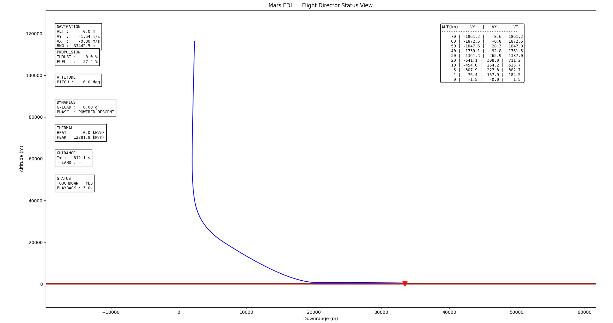
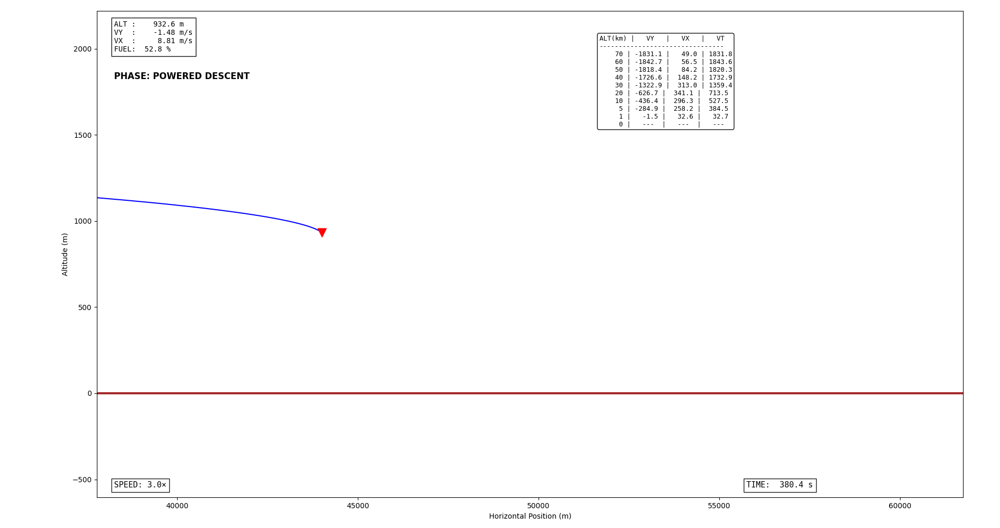
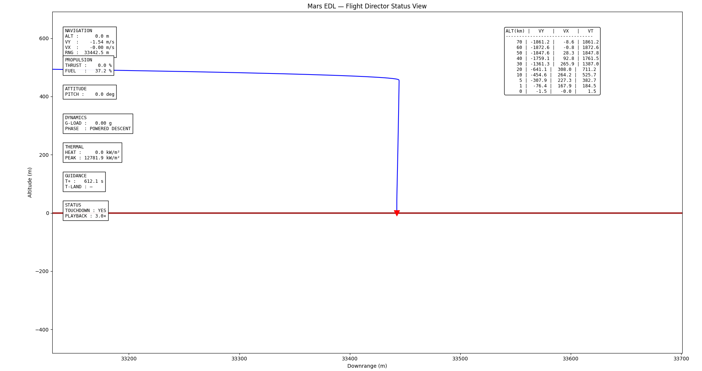

# ARES: Autonomous Reinforcement Learning for Mars Entry, Descent, and Landing

<p align="center">
  
  <br>
  <em>Simulation of full Mars EDL using RL for autonomous guidance</em>
</p>

<p align="center">
  <a href="https://github.com/ninadnaik03/Autonomous-Reinforcement-Learning-For-Mars-Entry-Descent-Landing-ARES/stargazers"></a>
  <a href="https://github.com/ninadnaik03/Autonomous-Reinforcement-Learning-For-Mars-Entry-Descent-Landing-ARES"></a>
  
  
</p>

**ARES** trains a deep reinforcement learning agent to autonomously guide a spacecraft through the complete **Mars Entry, Descent, and Landing (EDL)** sequence from hypersonic entry to soft powered touchdown, handling atmospheric uncertainties, fuel limits, and phase transitions for precise, efficient landings.

Inspired by NASA's Perseverance and Curiosity missions, but fully autonomous via RL instead of scripted guidance.

---

## Table of Contents

- [Project Highlights](#project-highlights)
- [Why RL for Mars EDL?](#why-rl-for-mars-edl)
- [EDL Phases Explained](#edl-phases-explained)
- [Visualizations](#visualizations)
- [Installation & Quick Start](#installation--quick-start)
- [Project Structure](#project-structure)
- [Roadmap](#roadmap)
- [Contributing & License](#contributing--license)

---

## Project Highlights

- **Full EDL Simulation** — ~130 km entry to 0 m touchdown
- **Custom Gym Environment** — Continuous states/actions, realistic Mars physics
- **Modular RL Setup** — Ready for PPO, SAC, etc. via Stable-Baselines3 or custom
- **Visual Tools** — Trajectory plots, animations, live telemetry dashboard
- **Realism** — Variable atmosphere, wind, entry errors, fuel constraints

---

## Why RL for Mars EDL?

Mars EDL is the "7 minutes of terror": extreme speeds, thin air, no second chances. Traditional methods (bank modulation, fixed triggers, polynomial guidance) work but are brittle to uncertainties. RL learns adaptive policies that optimize across phases for better robustness and fuel efficiency — future-proof for human missions.

---

## EDL Phases Explained

The agent controls the vehicle continuously across three phases:

### 1. Guided Entry
**~130 km → ~10 km**  
High-speed hypersonic deceleration (Mach 30+ → Mach ~2).  
**Agent controls**: Bank angle / lift vector for range-to-target steering.  
**Key metrics**: Peak heat flux (~1200-1300 kW/m²), g-loads, downrange accuracy.  
**Plots show**: Curved high-alt arcs, high VX, fuel ~80-90%.

### 2. Parachute Descent
**~10 km → ~1-2 km**  
Supersonic chute deploy, heatshield sep, drag-dominated slowdown (~400 m/s → ~70 m/s).  
**Agent may optimize**: Deploy timing / attitude.  
**Plots show**: Near-vertical drop, low VX drift, fuel high (~70%).

### 3. Powered Descent
**~2 km → 0 m**  
Rockets ignite for velocity nulling, hover, precise touchdown (<3 m/s vertical).  
**Agent controls**: Thrust vector & magnitude.  
**Plots show**: Low-alt corrections (e.g., ALT 300-1300 m, VY ~ -1.5 m/s, VX tweaks), fuel drop to ~40-50%, final vertical plunge to zero error.


---

## Visualizations

<p align="center">
  
  
  
</p>

---

## Installation & Quick Start

```bash
# Clone & setup
git clone https://github.com/ninadnaik03/Autonomous-Reinforcement-Learning-For-Mars-Entry-Descent-Landing-ARES.git
cd Autonomous-Reinforcement-Learning-For-Mars-Entry-Descent-Landing-ARES

# Virtual env
python -m venv venv
source venv/bin/activate  # Windows: venv\Scripts\activate

# Install deps (add your exact ones to requirements.txt later)
pip install numpy scipy matplotlib torch gymnasium stable-baselines3
